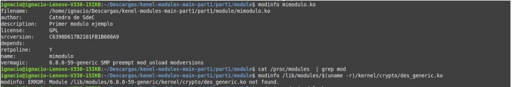
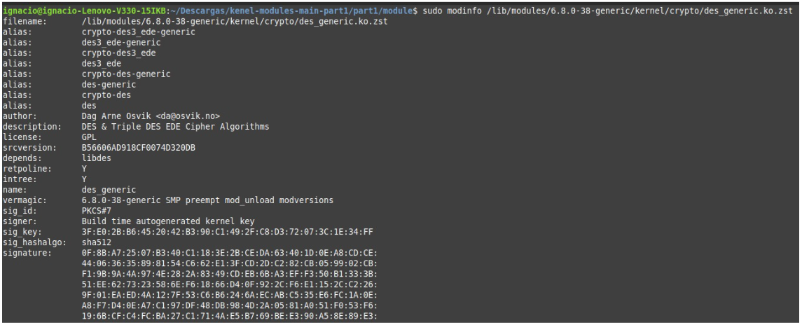
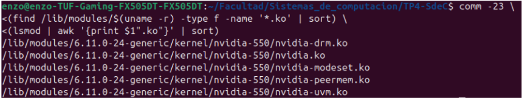
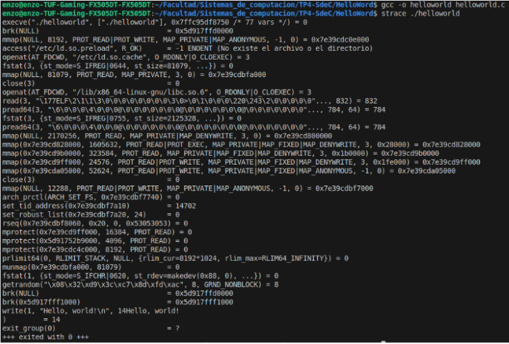
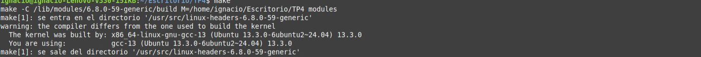
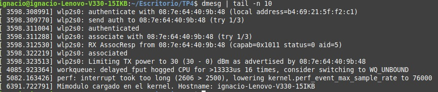
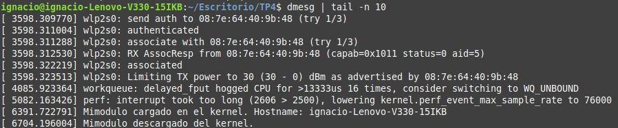

# Condiciones de aprobación 

En el transcurso de la clase se le plantearán dos desafíos que serán evaluados en coloquios grupales con la entrega de la segunda parte del TP\#4. Concretamente serán:

Desafío \#1   
¿Qué es checkinstall y para qué sirve?  
¿Se animan a usarlo para empaquetar un hello world ?   
Revisar la bibliografía para impulsar acciones que permitan mejorar la seguridad del kernel, concretamente: evitando cargar módulos que no estén firmados. rootkits ? 

Desafío \#2  
Debe tener respuestas precisas a las siguientes preguntas y sentencias:

* ¿ Qué funciones tiene disponible un programa y un módulo ?  
* Espacio de usuario o espacio del kernel.  
* Espacio de datos.  
* Drivers. Investigar contenido de /dev.

Bibliografía  
[https://access.redhat.com/documentation/es-es/red\_hat\_enterprise\_linux/8/html/managing\_monitoring\_and\_updating\_the\_kernel/signing-kernel-modules-for-secure-boot\_managing-kernel-modules](https://access.redhat.com/documentation/es-es/red_hat_enterprise_linux/8/html/managing_monitoring_and_updating_the_kernel/signing-kernel-modules-for-secure-boot_managing-kernel-modules)

[https://sysprog21.github.io/lkmpg/\#what-is-a-kernel-module](https://sysprog21.github.io/lkmpg/#what-is-a-kernel-module) 

[https://opensource.com/article/19/10/strace](https://opensource.com/article/19/10/strace) 

[https://docs.google.com/presentation/d/1BYES6Zkfx5K85REWyXsFeW-VngBLOzlDzaYCsTVoc0Y/edit\#slide=id.g724a4c87a0\_0\_5](https://docs.google.com/presentation/d/1BYES6Zkfx5K85REWyXsFeW-VngBLOzlDzaYCsTVoc0Y/edit#slide=id.g724a4c87a0_0_5)
 
--------------------------------------------------
# Pasos 

cd part1  
make  
sudo insmod mimodulo.ko  
sudo dmesg  
lsmod | grep mod

```
[67375.506122] mimodulo: loading out-of-tree module taints kernel.
[67375.506166] mimodulo: module verification failed: signature and/or required key missing - tainting kernel
[67375.506348] Modulo cargado en el kernel.
```

sudo rmmod mimodulo  
sudo dmsg  
lsmod | grep mod

cat /proc/modules  | grep mod

```
mimodulo 16384 0 - Live 0xffffffffc097e000 (OE)


```

modinfo mimodulo.ko   
modinfo /lib/modules/$(uname \-r)/kernel/crypto/des\_generic.ko

1. ¿Qué diferencias se pueden observar entre los dos modinfo ?   
2. ¿Qué divers/modulos estan cargados en sus propias pc? **comparar las salidas con las computadoras de cada integrante del grupo. Expliquen las diferencias. Carguen un txt con la salida de cada integrante en el repo y pongan un diff en el informe.**  
3. ¿cuales no están cargados pero están disponibles? que pasa cuando el driver de un dispositivo no está disponible.   
4. Correr hwinfo en una pc real con hw real y agregar la url de la información de hw en el reporte.   
5. ¿Qué diferencia existe entre un módulo y un programa  ?   
6. ¿Cómo puede ver una lista de las llamadas al sistema que realiza un simple helloworld en c?  
7. ¿Qué es un segmentation fault? ¿Cómo lo maneja el kernel y como lo hace un programa?  
8. ¿Se animan a intentar firmar un módulo de kernel ? y documentar el proceso ?  [https://askubuntu.com/questions/770205/how-to-sign-kernel-modules-with-sign-file](https://askubuntu.com/questions/770205/how-to-sign-kernel-modules-with-sign-file)  
9. Agregar evidencia de la compilación, carga y descarga de su propio módulo imprimiendo el nombre del equipo en los registros del kernel.   
10. ¿Que pasa si mi compañero con secure boot habilitado intenta cargar un módulo firmado por mi?   
11. Dada la siguiente nota [https://arstechnica.com/security/2024/08/a-patch-microsoft-spent-2-years-preparing-is-making-a-mess-for-some-linux-users/](https://arstechnica.com/security/2024/08/a-patch-microsoft-spent-2-years-preparing-is-making-a-mess-for-some-linux-users/)   
    1. ¿Cuál fue la consecuencia principal del parche de Microsoft sobre GRUB en sistemas con arranque dual (Linux y Windows)?  
    2. ¿Qué implicancia tiene desactivar Secure Boot como solución al problema descrito en el artículo?  
    3. ¿Cuál es el propósito principal del Secure Boot en el proceso de arranque de un sistema?

# DESAFIO 1

1. **Checinstall** es una herramienta que facilita la instalación y el seguimiento de software compilado manualmente. En lugar de simplemente ejecutar mae install, checkinstall crea un paquete e instala ese paquete en el sistema.  
   Esto nos permite desinstalar fácilmente el software, mediante un gesto de paquetes. Tambien mantiene el sistema mas limpio y organizado, asi como tambien facilita la redistribución del software en otros sistemas.  

3. Revisar la bibliografía para impulsar acciones que permitan mejorar la seguridad del kernel, concretamente: evitando cargar módulos que no estén firmados. rootkits ?   
   Sabemos que una forma de proteger el kernel, es permitiendo únicamente la carga de modulos firmados digitalmente, mediante el **secure boot** habilitado.  
   En cuanto a los **Rootkits**, sabemos que son un tipo de malware diseñado para esconder su presencia (o la de otros procesos) operando como un modulo kernel. 

# DESAFIO 2

1. ¿ Qué funciones tiene disponible un programa y un módulo ?

Primero necesitamos saber que es un programa y un módulo.

Un programa es una unidad ejecutable completa la cual tiene como funciones disponibles:

* Funciones propias, definidas por el programador.

* Funciones del sistema operativo, a través de llamadas al sistema (manejo de procesos, archivos, memoria, etc.).

* Funciones de bibliotecas estándar o externas, que amplían sus capacidades (como operaciones con cadenas, entrada/salida, etc.).

Y un módulo es una parte del programa que agrupa funciones relacionadas la cual tiene como funciones disponibles:

* Funciones internas, utilizadas solo dentro del módulo.

* Funciones exportadas, accesibles desde otros módulos o el programa principal.

* Funciones importadas, provenientes de otros módulos o bibliotecas.

* Funciones del sistema, si el módulo lo requiere (por ejemplo, en módulos del kernel).

En resumen, el programa integra y coordina múltiples funciones, mientras que el módulo organiza y encapsula funcionalidades específicas.

2.   Espacio de usuario o espacio del kernel.

**Espacio de usuario**:  
 Es la región de memoria donde se ejecutan los programas de aplicación. Los procesos que corren en este espacio no tienen acceso directo al hardware ni a la memoria del sistema. Para interactuar con el sistema operativo, deben realizar llamadas al sistema (system calls). Esta separación protege al sistema de errores o acciones maliciosas en los programas de usuario.

**Espacio del kernel**:  
 Es la zona donde se ejecuta el núcleo del sistema operativo y sus componentes (gestión de procesos, memoria, dispositivos, etc.). Tiene acceso completo al hardware y a todos los recursos del sistema. El código que corre en este espacio lo hace en modo privilegiado (modo kernel), lo que permite realizar operaciones críticas.

3. Espacio de datos.

El espacio de datos es una región de memoria dentro del espacio de direcciones de un proceso donde se almacenan las variables globales, estáticas y los segmentos de datos inicializados o no inicializados del programa.

Se divide comúnmente en dos partes:

* Datos inicializados: contiene variables globales o estáticas a las que se les asigna un valor al momento de la compilación.

* Datos no inicializados (BSS): contiene variables globales o estáticas que no tienen un valor inicial definido. Se inicializan en cero en tiempo de ejecución.

Este espacio forma parte de la memoria del proceso y es gestionado por el sistema operativo cuando se carga el programa.

4. Drivers. Investigar contenido de /dev.

Los drivers son módulos de software que permiten al sistema operativo interactuar con el hardware. Cada tipo de hardware necesita un driver específico que interprete y traduzca las instrucciones del sistema operativo en comandos que el dispositivo pueda entender.	En Linux, `/dev` contiene archivos especiales que representan esos dispositivos y permiten a los programas acceder a ellos como si fueran archivos normales.

Hay dos tipos principales:

* **Dispositivos de carácter**: se accede a ellos byte a byte (ej.: `/dev/tty`, `/dev/random`).

* **Dispositivos de bloque**: se accede a ellos en bloques de datos (ej.: discos como `/dev/sda`, `/dev/sdb1`).

# Desafio de 11 preguntas

1. Al consultar por la informacion de nuestro módulo observamos lo siguiente  
   
   Ahora al consultar por la informacion del otro módulo vemos:  
     
   A la hora de compararlos podemos decir que la diferencia principal entre los dos comandos modinfo es que en el segundo caso se está consultando un módulo del kernel oficial del sistema (des\_generic.ko.zst), que forma parte de los módulos de criptografía del núcleo de Linux, está comprimido, firmado digitalmente y ubicado en la carpeta del sistema (/lib/modules/...). En cambio, en el primer caso se está consultando un módulo personalizado (mimodulo.ko) desarrollado por un Catedra de SdeC, que no está comprimido ni firmado, y se encuentra en una carpeta local del usuario. Además, los módulos pertenecen a versiones distintas del kernel, lo que también explica por qué uno puede no estar disponible en el otro entorno.

2.  Carpeta comparacion modulos 
     
3.  Este punto apunta a diferenciar entre:  
* **Módulos cargados:** los que actualmente están siendo utilizados por el sistema (vistos con `lsmod` o `/proc/modules`).

* **Módulos disponibles:** los que están instalados en tu sistema pero aún **no están cargados en el kernel**.

  Vamos a ver los modulos que estan disponibles pero no cargados:  
     
  Si estos se necesitan pero no se cargan automaticamente los podemos cargar manualmente.  
  Si el **driver del dispositivo no está cargado**, **el dispositivo no funciona**.  
  Ejemplo: si no está cargado `snd_hda_intel`, es posible que **no tengas sonido**.  
  Si **el módulo no existe**, entonces:

  * Puede que **no esté instalado** (falta el paquete).

  * Puede que el **hardware no sea compatible**.

  * Puede que necesites compilar el módulo o usar uno **privativo** (como los de NVIDIA o Broadcom).

4. Se subió el resultado de la ejecución a la carpeta HWinfo en un archivo .txt.  
   importancia de esto:  
- Te permite ver si hay hardware no reconocido.  
- Podés asociar qué módulos están o deberían estar cargados.  
- Te ayuda a identificar diferencias entre PCs reales y virtuales.

5.  **Diferencia entre un módulo y un programa**

**Programa:**

* Es un archivo ejecutable que corre en espacio de usuario (user space).

* Se ejecuta como un proceso independiente.

* No tiene acceso directo al hardware ni al kernel.

* Para interactuar con el kernel, usa llamadas al sistema (syscalls).

* Ejemplos: navegadores web, editores de texto, juegos.

**Módulo del kernel:**

* Es código que se carga y ejecuta dentro del espacio del kernel (kernel space).

* Extiende o modifica la funcionalidad del kernel sin necesidad de recompilarlo o reiniciar.

* Tiene acceso directo a hardware y a recursos críticos del sistema.

* Puede ser cargado (`insmod`) y descargado (`rmmod`) en tiempo de ejecución.

* Ejemplos: drivers de dispositivos, sistemas de archivos, módulos de seguridad.  
6. Se realiza un programa en C que imprima un “Hello, world” y se ejecuta con el comando ‘strace ./helloworld’ que muestra en pantalla todas las llamadas al sistema que hace el programa mientras corre.  
        

   ### **Análisis de la salida `strace ./helloworld`**

* `execve("./helloworld", ...)`  
   El programa `helloworld` es ejecutado, el kernel carga el binario y los argumentos.

* `brk(NULL)` y `brk(0x5d917fff1000)`  
   Gestión del heap, el programa pide memoria al sistema para la ejecución.

* `mmap(...)`  
   Mapeo de memoria para librerías y datos, por ejemplo, cargar `libc.so.6` (la biblioteca estándar de C).

* `openat(...)`, `read(...)`, `close(...)`  
   El programa accede al sistema de archivos para cargar la configuración y las librerías necesarias (ejemplo: `/etc/ld.so.cache` y la librería `libc.so.6`).

* `write(1, "Hello, world!\n", 14)`  
   Escribe la cadena en el descriptor 1, que es stdout (la pantalla).

* `exit_group(0)`  
   Finaliza el proceso con código de salida 0\.

 	**¿Por qué es importante esta lista?**

* Nos muestra la interacción directa con el kernel: apertura de archivos, asignación de memoria, escritura en pantalla, terminación del proceso.

* Nos ayuda a entender que aunque el programa es muy simple, hace muchas llamadas al sistema para funcionar correctamente.


7. Un **segmentation fault (segfault)** es un error que ocurre cuando un programa intenta acceder a una zona de memoria que no tiene permiso para usar, o intenta acceder a memoria de forma incorrecta (por ejemplo, escritura en una dirección de solo lectura).  
   Cada proceso tiene asignado un espacio de direcciones de memoria, con permisos (lectura, escritura, ejecución). Si el programa intenta acceder fuera de ese espacio o a memoria con permisos prohibidos, el hardware detecta esta violación. La CPU genera una excepción de violación de segmento y notifica al kernel.

   ### **Manejo por el kernel**

* El kernel recibe esta excepción y envía una señal SIGSEGV al proceso que causó la violación.

* Si el proceso no maneja esta señal, el kernel termina el proceso inmediatamente (core dump opcional).

* Esto evita que el programa corrompa la memoria o afecte a otros procesos o al sistema.

### **Manejo por un programa**

* El programa puede instalar un handler para la señal SIGSEGV para intentar manejar la excepción (poco común, usado en depuradores o entornos especiales).

* Usualmente, el programa no maneja el segfault y termina abruptamente.  
  
  
8.   A continacion documentamos el Proceso de firma paso a paso:  

Generación de la clave y certificado
   -------------------------------------
   Se generó un par de clave privada y certificado X.509 autofirmado:

   Comando:
   openssl req -new -x509 -newkey rsa:2048 -keyout my_key.priv -outform DER -out my_key.der -nodes -days 36500 -subj "/CN=MiModulo/"

   Archivos generados:
   - my_key.priv (clave privada)
   - my_key.der (certificado público en formato DER)

Compilación del módulo
   -----------------------
   Se utilizó un módulo simple llamado "mimodulo.ko", compilado con un Makefile estándar utilizando los headers del kernel.

   Comando:
   make

Firma del módulo
   -----------------
   Se procedió a firmar el archivo binario del módulo (.ko) utilizando el script sign-file provisto por el kernel.

   Comando:
   sudo /usr/src/linux-headers-$(uname -r)/scripts/sign-file sha256 my_key.priv my_key.der mimodulo.ko

   Resultado:
   El módulo fue modificado en su contenido binario, incluyendo una firma digital basada en SHA256.

Verificación
   -------------
   Se utilizó el comando modinfo para observar información del módulo firmado.

   Comando:
   modinfo mimodulo.ko

   Resultado esperado (fragmento relevante):
   signature: 00:00:00:...

Carga del módulo en el kernel
   ------------------------------
   El módulo fue cargado utilizando insmod y verificado en los registros del kernel.

   Comando:
   sudo insmod mimodulo.ko
   dmesg | tail -n 10

   Mensaje esperado:
   [timestamp] mimodulo: módulo cargado correctamente (firmado).

Conclusión de la actividad:
-----------
El proceso de firmado de un módulo de kernel fue exitoso. Este procedimiento contribuye a mejorar la seguridad del sistema, impidiendo que módulos no autorizados (como rootkits) se carguen en el kernel, especialmente en sistemas protegidos por Secure Boot.

9. A continuacion presentaremos las imagenes de nuestro propio modulo siendo compilado, cardgado y descargado
 **Compilacion del modulo**  
  
**Carga del modulo**  
  
**Descarga del modulo**  
  
   
10. Secure Boot es una característica que asegura que solo software firmado y confiable pueda ejecutarse durante el proceso de arranque, incluyendo módulos del kernel. El kernel de Linux, cuando Secure Boot está activo, verifica las firmas digitales de los módulos antes de cargarlos.  
    Si mi compañero tiene Secure Boot habilitado, su sistema sólo permitirá cargar módulos firmados con claves que estén registradas y confiables para ese sistema.

    Aunque yo firmes un módulo con mi propia clave, si esa clave no está registrada en el sistema de mi compañero (no está en la base de claves confiables del kernel), entonces:

    1. El módulo será rechazado y no se cargará.

    2. El kernel mostrará un mensaje de error indicando que el módulo está “unsigned” o que la firma no es válida.

    3. En el log del kernel (`dmesg`) aparecerá información relacionada con el rechazo del módulo.  
       

12. ####  **Resumen de la situación**

    En 2024, Microsoft lanzó un **parche de seguridad** para mitigar una vulnerabilidad crítica en GRUB2, el gestor de arranque ampliamente utilizado por Linux. La vulnerabilidad permitiría, en algunos casos, ejecutar código malicioso durante el arranque si Secure Boot estaba habilitado.  
a. El parche invalida versiones antiguas de GRUB firmadas, rompiendo el arranque de muchas instalaciones de Linux en sistemas con arranque dual. Esto provoca que el sistema no arranque: aparece una pantalla negra o errores del tipo `shim_lock` o directamente se salta el arranque de Linux.

   Muchos usuarios con dual boot Windows \+ Linux vieron que su instalación de Linux ya no arrancaba tras aplicar actualizaciones de Windows. Algunas distribuciones tuvieron que actualizar sus imágenes y firmar nuevos GRUB para evitar quedar inservibles en sistemas con Secure Boot.

b. Desactivar Secure Boot elimina la validación criptográfica del software que se ejecuta durante el arranque.

   #### **Ventajas (aparentes o inmediatas)**

* Permite arrancar versiones de GRUB y kernels que fueron invalidadas por la actualización de la base de revocación (dbx).

* Restaura el funcionamiento de un sistema Linux que quedó inutilizado tras el parche de Microsoft.

* Facilita la carga de módulos del kernel no firmados (útil en desarrollos como este TP).

		**Desventajas (reales y de seguridad)**

* Se pierde la protección frente a ataques que comprometan el arranque (bootkits, rootkits).

* Cualquier binario malicioso podría ejecutarse desde el arranque sin ser detectado por el firmware.

* El sistema puede arrancar desde medios externos con software no confiable sin alertar.


c. Propósito principal: evitar la ejecución de software no autorizado o malicioso durante el arranque del sistema operativo.

   **Funcionamiento:**

   Secure Boot forma parte del firmware UEFI y utiliza criptografía de clave pública para:

1. Verificar la firma digital de cada componente de arranque (bootloader, kernel, etc.).

2. Permitir o denegar la ejecución según si la firma es válida y confiable.

3. Detener el arranque si detecta binarios alterados o no firmados.

   **Contra qué protege:**

   Protege contra ataques de bajo nivel como:

* Bootkits (malware que se carga antes del SO).

* Rootkits persistentes.

* Software malicioso que se infiltra en el arranque para ocultarse del antivirus.
